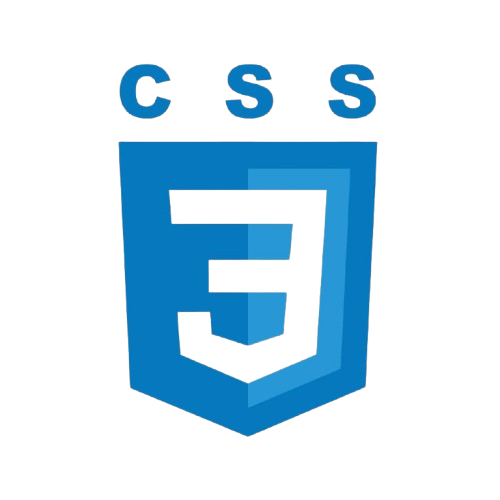

<h1>Yo!  Nice to see you here...</h1>

<h3>Can find me here</h3>

<h5 align="center">
  <code><a href="https://www.linkedin.com/in/zrrehan/" title="LinkedIn Profile"> LinkedIn</a></code>
  <code><a href="https://wa.me/+8801793158877" title="Whatsapp Profile"> Whatsapp</a></code>
  <code><a href="https://leetcode.com/u/rehan_redia_11/" title="Leetcode Profile"> Leetcode</a></code>
  <code><a href="htthttps://x.com/r_rrehan_" title="X Profile"> X / twitter</a></code>
</h5>

<h3>Things I code with</h3>
<table>
  <tr>
    <td align="center" width="96">
      
       
HTML

    </td>
    <td align="center" width="96">
      
       
CSS

    </td>
    <td align="center" width="96">
      
       
      
Tailwind

    </td>
    <td align="center" width="96">
      
       
JavaScript

    </td>
    <td align="center" width="96">
      
       
React JS

    </td>
    <td align="center" width="96">
      
       
Firebase

    </td>
    <td align="center" width="96">
      
       
      
ExpressJS

    </td>
    <td align="center" width="96">
      
       
      
MongoDB

    </td>
    <td align="center" width="96">
      
       
      
Python

    </td>
  </tr>
</table>